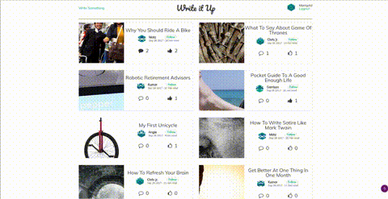
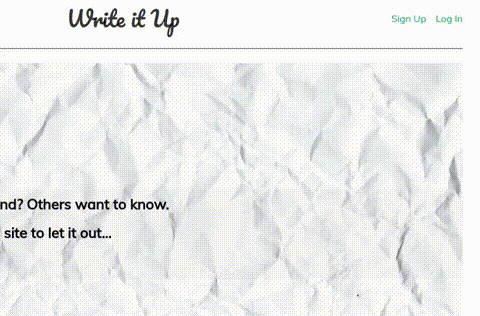
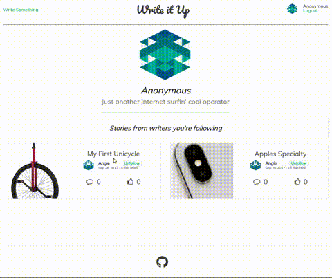

# [www.write-it-up.com](https://write-it-up.herokuapp.com/)

Write it Up is a SPA (**s**ingle **p**age web **a**pplication) centered around stories. Users can create, like and comment on stories, as well as follow other users. The application has two main parts: a Ruby on Rails back end, and a React-Redux front end.

See the [wiki](https://github.com/candyapplecorn/discourse/wiki) for Write it Up's project proposal, which includes the database schema, component wireframes and more.

## Feature Highlights

### _Responsive CSS_

Write it Up uses CSS ```@media``` queries to adjust the look of the site based on screen width:



### _Demo Login Animation_



Taking __Write it Up__ for a test drive is as easy as clicking a button. Logging in instantly doesn't give as much satisfaction as seeing the website type credentials in. This was easily implemented with some calls to Javascript's ```setTimeout```.

### _Elevated State_
[Redux](http://redux.js.org/) is a flavor of [Flux](https://facebook.github.io/flux/) which keeps a single top-level, global state, known as the _store_. This global store is treated as the "single source of truth". Connecting components to the Redux store simplifies managing an application's state. These ```FollowButton``` React components are wired to the Redux store:


All ```FollowButton``` components connect to and may affect the Redux store. A change caused by one component is read by all, creating cool behaviour for free.

A common design pattern in React + Redux is to split features into container and presentational components. Containers connect to the Redux store and import their state, as well as wrap around presentational components, supplying them with information. The presentational component for the ```FollowButton``` only needs to know two things:

1. Is the _current user_ following this user? The buttons need to say "Follow" or "Unfollow".
2. Is anyone even logged in? Only registered users should see a ```FollowButton```.

This information can be provided by selecting a slice of state from the Redux store. This is conventionally done in the container component's ```mapStateToProps``` function:

```js
const mapStateToProps = (state, ownProps) => {
  const { id } = ownProps;
  const { currentUser } = state.session;
  const followee_ids = currentUser ? currentUser.followee_ids : [];

  return {
    following: id in followee_ids,
    hidden: !Boolean(currentUser)
  };
};
```

Follows is a table in the database; _delete_ a row to unfollow a user, or _create_ a row to follow. The presentational component needs to be able to perform these tasks. The container component thus provides the presentational component with these [thunk action creators](https://stackoverflow.com/questions/35411423/how-to-dispatch-a-redux-action-with-a-timeout/35415559#35415559):

```js
const mapDispatchToProps = (dispatch, { id }) => ({
  createFollow: () => dispatch(createFollow(id)),
  deleteFollow: () => dispatch(deleteFollow(id))
});
```

Other components may react to changes caused by a ```FollowButton```. Below is a ```StoryIndex``` filled with ```StoryIndexItems```. Only _followed_ users' stories appear here; watch what happens when this user _unfollows_ some users:


The ```FollowButton``` and ```StoryIndex``` components share a common slice of state in the Redux store. This allows changes originating from one component to affect others.

The ```Like``` component also benefits from elevated state. ```StoryIndexItem``` components display comment and like counts, and _liking_ or _unliking_ a story affects these counts. Because the ```StoryIndexItem``` and ```Like``` component read from the same slice of state, toggling the ```Like``` component changes the counts in ```StoryIndexItem```:



The ```Like``` component's container was simple enough:

```js
const mapStateToProps = ({ likes }) => ({
  likes
});

const mapDispatchToProps = (dispatch, { match: { params: { id }}}) => ({
  action: currentUserLikes => currentUserLikes ?
            dispatch(deleteLike(id)) : dispatch(createLike(id))
});
```

Handling clicks in the presentational component is succint too:

```js
handleClick(){
  if (this.state.ui)
    this.props.action(
      this.props.likes.current_user_likes
    ).then(() => this.setState({ ui: true }));

  this.setState({ ui: false })
}
```

### _Asynchronous Ruby on Rails API_

All requests from the front end are made through AJAX to routes namespaced under _api_. Rails serves just a single html page: the root page, upon which React bootstraps itself. The back end offers these routes as an API:

```rb
root to: "static_page#root"

namespace :api, defaults: { format: :json } do
  resource :session, only: [:create, :destroy]
  resources :users, only: [:new, :create, :show]
  resources :comments, only: [:destroy, :update]
  resources :follows, only: [:destroy, :create]
  resources :stories, except: [:new, :edit] do
    resources :comments, only: [:index, :create]
    resources :likes, only: [:destroy, :create]
  end
end
```

The React front end then uses "component_util.js" files to make AJAX requests to the back end API, with functions like this:

```js
export const delete_comment = commentId => $.ajax({
  url: `/api/comments/${commentId}`,
  method: 'delete'
});

export const create_comment = (storyId, comment) => $.ajax({
  url: `/api/stories/${storyId}/comments`,
  method: 'post',
  data: { comment }
});
```

These util files' functions are incorporated into the Redux cycle by using them to create thunk action creators. Components then dispatch these actions to perform tasks, such as creating or deleting comments. This all happens asynchronously without reloading the page, resulting in a fast SPA experience.
